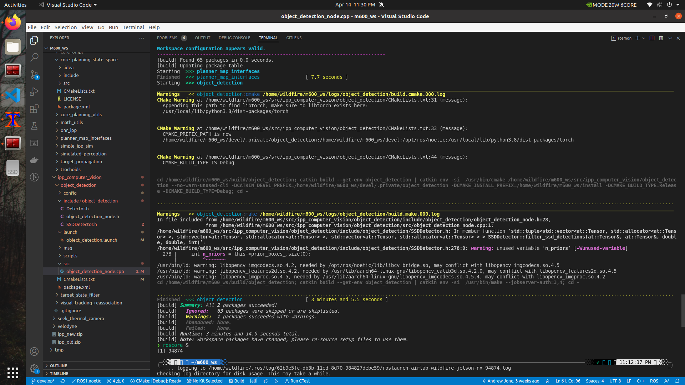
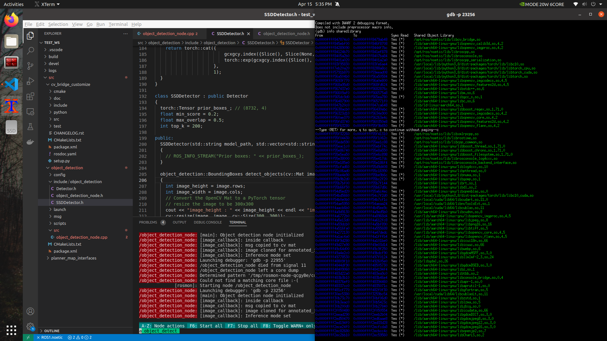

# CV Bridge Customize

This repo solves the problem where multiple versions of OpenCV has to coexist, typical cases of failure:

* 
    Potentially conflicting .so lib versions

  * To reproduce, do not use this repo, then compile your packages that depend on both cv_bridge and libopencv-dev

* 
    Multiple versions of OpenCV libs are loaded together, you can see that both `/lib/aarch64-linux/gnu/libopencv_imgcodecs.so.4.2` and `lib/aarch64-linux/gnu/libopencv_imgcodecs.so.4.5` are loaded, similar for other OpenCV libs

  * To reproduce, do not install OpenCV from source, then `mon launch` your node, start gdb debugger, and do `info sharedlibrary`

## USAGE

1. Put this package under your catkin workspace

1. Build OpenCV from source and install under `/usr/local` (default location of `sudo make install`)

    1. Set `OpenCV_DIR="/usr/local/lib/cmake/opencv4/"` in `/etc/environment` to set environment variable, `source` or logout and login for it to take effect. You can also `export` for temporary tests or set it in your `~/.bashrc`
    1. `sudo ldconfig`
    1. You can also build a .pc package-config and manually install it using `pkg-config` to formalize the process

1. Modify the [package.xml](./package.xml) and [CMakeLists.txt](./CMakeLists.txt) of your packages that require both OpenCV and cv_bridge

    1. [package.xml](./package.xml): **replace** all dependency of `cv_bridge` with `cv_bridge_customize`

    1. [CMakeLists.txt](./CMakeLists.txt): **replace** `find_package(catkin REQUIRED COMPONENTS cv_bridge <other packages ...>)` with `find_package(catkin REQUIRED COMPONENTS cv_bridge_customize <other packages ...>)`

## Mechanism

* Typically, the cv_bridge shipped with the official ROS Melodic depends on OpenCV 3.2.0, and the default version of libopencv-dev on Ubuntu 18.04 is 4.1.1

  * On Xavier NX, the library .so files of these are mixed in the same directory: `/usr/lib/aarch64-linux-gun/`, the exact architecture varies depending on your platform, but can be referenced in cmake using `${CMAKE_LIBRARY_ARCHITECTURE}`

* When your package requires both libraries (cv_bridge and opencv), they will reference link libraries .so files at compile time and load them at runtime

  * Using this cv_bridge_customize eliminates the compile-time warning, because now the OpenCV version depency is unified
  * Installing OpenCV from source in a separate directory solves the runtime problems, because **.so files with the same name under the same directory will all be loaded at runtime**. You'll find that they are mostly symlinked. In the case of OpenCV, it's usually `libopencv_imgcodecs.so*` and `libopencv_imgproc.so*`. Locally built and installed OpenCV will have .so libraries in `/usr/local/lib/` instead of `/usr/lib/${CMAKE_LIBRARY_ARCHITECTURE}/`, thus are quarantined from the mixed version OpenCV libs

* So it's necessary to make sure that the dependencies and the package itself uses the same version of a library

  * The low level data structure of these open source libraries may change across different releases

* This repo is created from a clone of [the melodic branch of vision_opencv](https://github.com/ros-perception/vision_opencv/tree/melodic). It changes the name in [package.xml](./package.xml) and [CMakeLists.txt](./CMakeLists.txt) to make explicit distinction from the official package,then pull the opencv4 implementation of `/src/module_opencv4.cpp` from [the noetic branch](https://github.com/ros-perception/vision_opencv/tree/noetic)

  * Feel free to upgrade this repo if you find new releases/modifications in the official repo.
